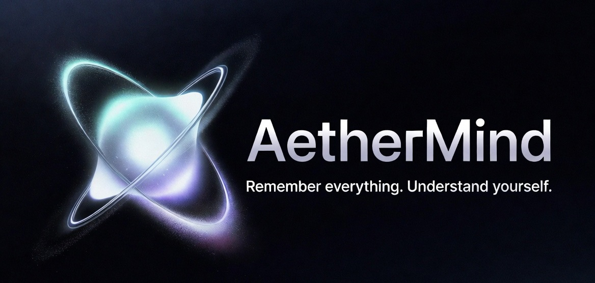
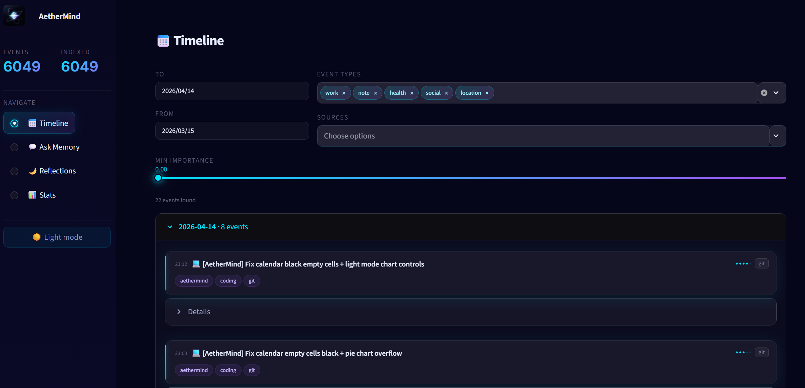

<p align="center">
  
</p>

<p align="center">
  <b>Private AI that remembers your life. Locally. Forever.</b><br/>
  <sub>Local-first &nbsp;·&nbsp; Privacy-first &nbsp;·&nbsp; Zero cloud &nbsp;·&nbsp; Zero subscriptions &nbsp;·&nbsp; Open source</sub>
</p>

AetherMind is a personal cognitive infrastructure: it collects data from your life (git commits, notes, calendar, location history), creates semantic memories using local AI, reflects on your days, and answers natural language questions about your past.

<p align="center">
  
</p>

---

## Features

- **Automatic data collection** - git commits, notes, Google Calendar, Google Takeout Timeline
- **Incremental sync** - only imports new data; full deduplication via content hashing
- **Semantic memory search** - ask "when was I most productive?" and get answers from your actual history
- **Daily AI reflection** - local LLM generates daily summaries, wins, risks, and pattern detection
- **100% local** - runs on your machine; no data leaves your computer
- **CUDA-accelerated** - embeddings run on your GPU for speed
- **Streamlit UI** - Timeline, Ask Memory, Reflections, Stats views
- **One-command setup** - `python setup.py` handles everything

---

## Architecture

```
Data Sources                Pipeline                   Storage
────────────                ────────                   ───────
📝 Notes (.md/.txt)  ─┐    collect.py                 SQLite (events)
💻 Git commits       ─┤ →  normalize.py   →   embed → Qdrant (vectors)
📅 Google Calendar   ─┤    index.py                   JSONL (log)
🗺  Google Timeline  ─┘    reflect.py                 JSON (reflections)
                            │
                            ▼
                     Ollama (local LLM)
                     BAAI/bge-small embeddings
                            │
                            ▼
                     ask.py / app.py (Streamlit UI)
```

---

## Quick Start

### Prerequisites

- Python 3.11+
- [Ollama](https://ollama.ai/download) installed
- NVIDIA GPU recommended (RTX series with CUDA 12.x)

### 1. Clone & setup

```bash
git clone https://github.com/YOUR_USERNAME/aethermind.git
cd aethermind
python setup.py
```

The setup wizard will:
- Check system requirements
- Install all Python dependencies
- Optionally connect your Google account
- Configure daily automation
- Run the first import

### 2. Pull the AI model

```bash
ollama pull qwen2.5:7b
```

### 3. Add your data

```
input/
├── notes/                    ← Drop .txt or .md files here
├── calendar.csv              ← Export from Google/Outlook/Apple Calendar
└── Semantic_Location_History/ ← Google Takeout → Location History → JSON files
```

### 4. Run the pipeline

```bash
python run_pipeline.py
```

### 5. Open the UI

```bash
streamlit run app.py
```

### 6. Ask your memory

```bash
python ask.py "When was I most productive?"
python ask.py "What projects did I work on in March?"
python ask.py "How many times did I go to the gym this month?" --type health
python ask.py --interactive
```

---

## Google Calendar Setup

AetherMind can automatically sync your Google Calendar events.

### 1. Create Google Cloud credentials

1. Go to [Google Cloud Console](https://console.cloud.google.com/)
2. Create a new project: **AetherMind**
3. Enable the **Google Calendar API**:
   `APIs & Services → Library → Search "Calendar API" → Enable`
4. Create OAuth credentials:
   `APIs & Services → Credentials → Create Credentials → OAuth client ID`
   - Application type: **Desktop app**
   - Name: `AetherMind`
5. Click **Download JSON**
6. Save as: `credentials/google_client_secret.json`

### 2. Authenticate

```bash
python setup.py    # Step 4 runs OAuth (opens browser)
```

or directly:

```bash
python -c "from collect.google_calendar import get_credentials; get_credentials()"
```

### 3. How it works

- **First sync**: fetches all events from the past year
- **Subsequent syncs**: uses Google's `syncToken` - only fetches changes since last sync (fast)
- **Token storage**: saved in `credentials/google_token.json` (auto-refreshes, never expires)
- **All calendars**: syncs every calendar on your account (configurable in `config.yaml`)

> Note: `credentials/` is gitignored. Your tokens never leave your machine.

---

## Google Timeline (Location History)

Google does not provide an API for Maps Timeline. Options:

**Option A - Google Takeout (recommended)**
1. Go to [takeout.google.com](https://takeout.google.com)
2. Select only "Location History (Timeline)"
3. Export as JSON
4. Extract the ZIP → copy `Semantic_Location_History/` to `input/`
5. Run `python run_pipeline.py`

AetherMind handles both old format (`timelineObjects`) and new format (`semanticSegments`).

**Option B - OwnTracks (continuous tracking)**
Set up [OwnTracks](https://owntracks.org/) on your phone → export GPX → import as notes.

---

## Daily Automation

After running `python setup.py`, two Windows Task Scheduler tasks are created:

| Task | Time | Action |
|------|------|--------|
| `AetherMind-Pipeline` | 20:00 | Collect + normalize + index |
| `AetherMind-Reflect` | 21:00 | AI daily reflection |

Manual management:
```bash
# View tasks
schtasks /query /tn "AetherMind-Pipeline"

# Delete tasks
schtasks /delete /tn "AetherMind-Pipeline" /f
schtasks /delete /tn "AetherMind-Reflect" /f

# Re-run setup
python setup.py
```

---

## CLI Reference

```bash
# Setup
python setup.py                                    # Full setup wizard

# Pipeline
python run_pipeline.py                             # Full pipeline (collect+normalize+index)
python run_pipeline.py --stages collect,normalize  # Specific stages
python run_pipeline.py --reflect                   # Reflection only
python run_pipeline.py --source git                # One source only

# Individual modules
python normalize.py --dry-run                      # Preview events without saving
python index.py --stats                            # Show vector index stats
python index.py --rebuild                          # Rebuild Qdrant from scratch
python reflect.py --date 2026-04-14               # Reflect on specific date
python reflect.py --force                          # Overwrite existing reflection

# Q&A
python ask.py "question"                           # One-shot question
python ask.py "question" --type health             # Filter by event type
python ask.py "question" --since 2026-01-01        # Only events after date
python ask.py --interactive                        # REPL mode

# UI
streamlit run app.py                              # Web interface (localhost:8501)
```

---

## Configuration

All settings in `config.yaml`:

```yaml
embedding:
  model_name: "BAAI/bge-small-en-v1.5"  # 384-dim, MIT license
  device: "cuda"                          # "cuda" or "cpu"
  batch_size: 128                         # Higher = faster on good GPU

ollama:
  model: "qwen2.5:7b"                    # Any Ollama model
  temperature: 0.3                        # Lower = more factual

collect:
  google_calendar:
    lookback_days: 365                    # How far back on first sync
    calendars: []                         # [] = all calendars
  git:
    max_days_back: 365
  google_timeline:
    min_duration_minutes: 5               # Skip very short visits

ask:
  top_k: 8                               # Events to retrieve per query
  rerank: true                           # Hybrid semantic+importance reranking
```

---

## Data Sources

| Source | Format | Collection |
|--------|--------|------------|
| Notes | `.txt`, `.md` | Drop in `input/notes/` |
| Git commits | Auto-detected | Automatic (all local repos) |
| Google Calendar | API (OAuth) | Automatic (incremental sync) |
| Calendar CSV | `.csv` | Drop `input/calendar.csv` |
| Google Timeline | JSON (Takeout) | Drop in `input/Semantic_Location_History/` |

---

## Project Structure

```
aethermind/
├── setup.py               ← First-run wizard
├── run_pipeline.py        ← Daily orchestrator
├── config.yaml            ← All configuration
├── storage.py             ← SQLite + Qdrant layer (immutable core)
├── normalize.py           ← Raw data → canonical events
├── index.py               ← GPU embedding → Qdrant
├── reflect.py             ← Daily AI reflection
├── ask.py                 ← CLI RAG Q&A
├── app.py                 ← Streamlit web UI
├── collect/
│   ├── notes.py           ← .txt/.md collector
│   ├── git_collector.py   ← Git commit collector
│   ├── google_calendar.py ← Google Calendar API (OAuth + incremental)
│   ├── calendar_collector.py ← CSV calendar fallback
│   └── google_timeline.py ← Google Takeout JSON parser
├── credentials/           ← OAuth tokens (gitignored)
├── input/                 ← Drop your data files here (gitignored)
├── data/                  ← Canonical events + reflections (gitignored)
├── db/                    ← SQLite + Qdrant storage (gitignored)
└── logs/                  ← Pipeline logs (gitignored)
```

---

## Privacy

- **All data stays local** - nothing is sent to external servers
- **No API keys required** - LLM runs via Ollama on your machine
- **Embeddings run locally** - `BAAI/bge-small-en-v1.5` runs on your GPU
- **Google OAuth tokens** are stored in `credentials/` which is gitignored
- **Personal data directories** (`input/`, `data/`, `db/`) are gitignored

---

## Recovery

If something breaks:

```bash
# Rebuild vector index (SQLite is source of truth)
python index.py --rebuild

# Re-run normalization only
python normalize.py

# Check what's in the database
python index.py --stats

# View pipeline logs
cat logs/pipeline.log
```

---

## Roadmap

- [ ] OwnTracks/GPX location import
- [ ] Voice notes via Whisper (local)
- [ ] GitHub API integration (PRs, issues)
- [ ] Weekly summary report (PDF/email)
- [ ] Pattern detection engine ("you abandon projects after 12 days")
- [ ] Mobile companion app (Flutter)

---

## License

MIT - use freely, keep private, share improvements.

---

*Built for people who want AI to know them better than Google does - but only on their own terms.*
